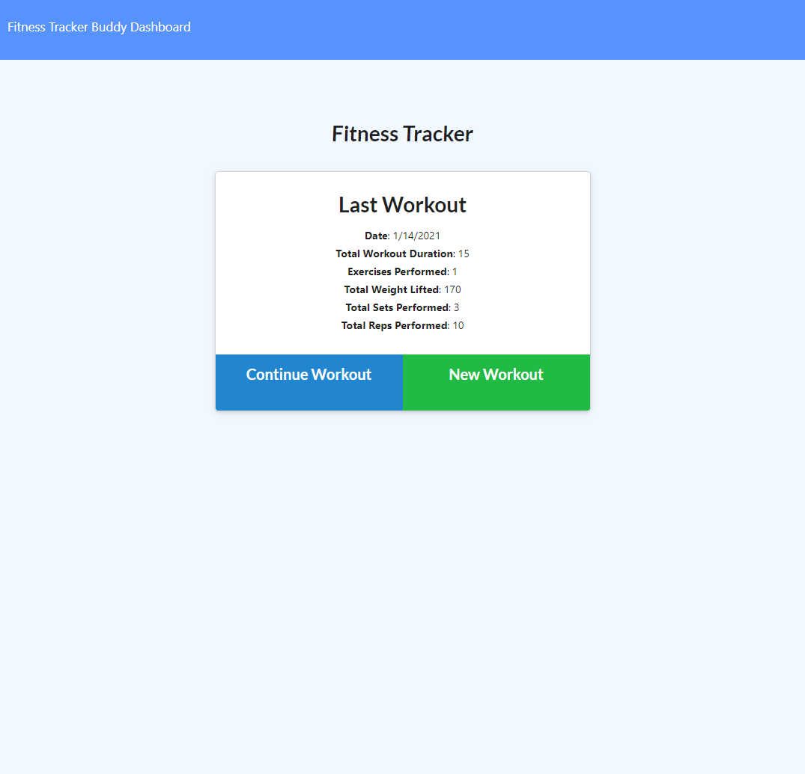
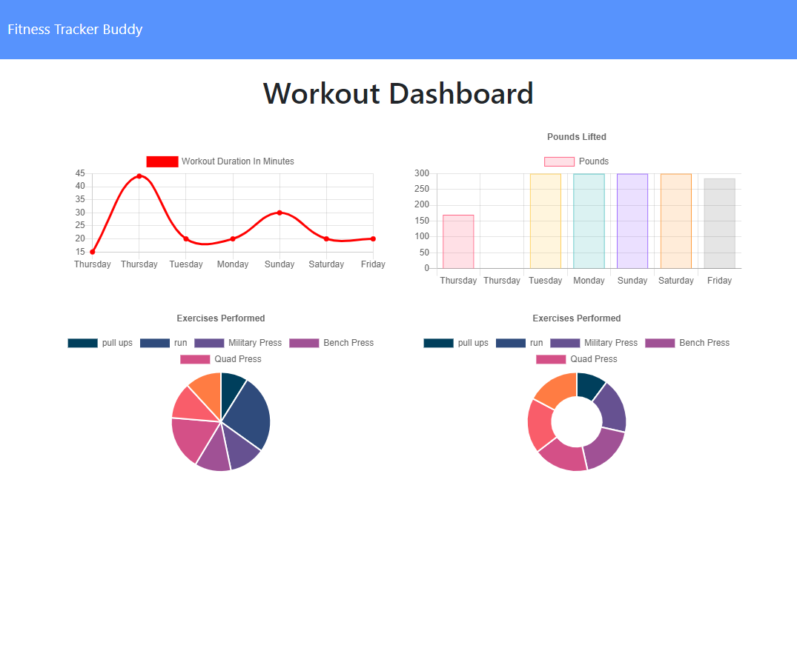
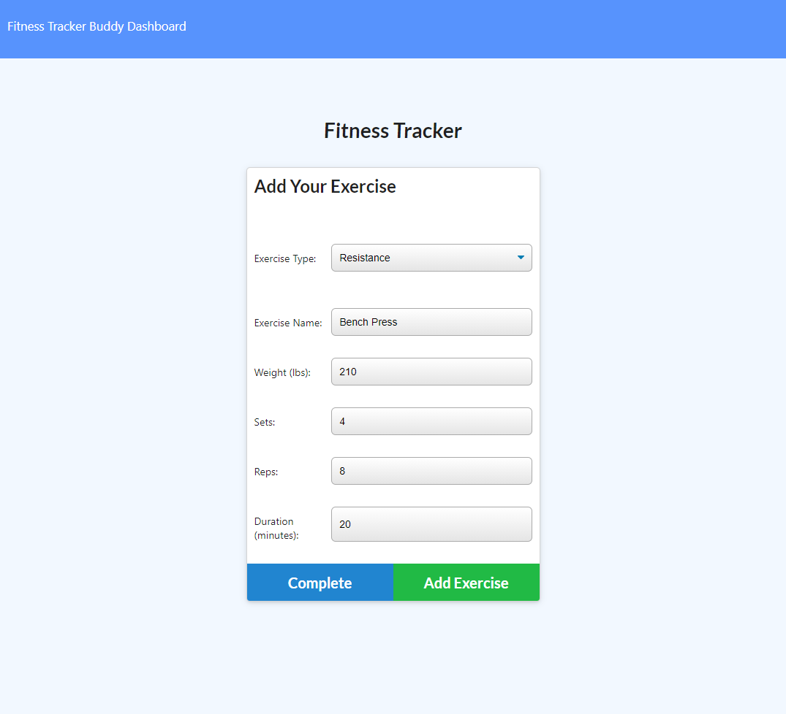
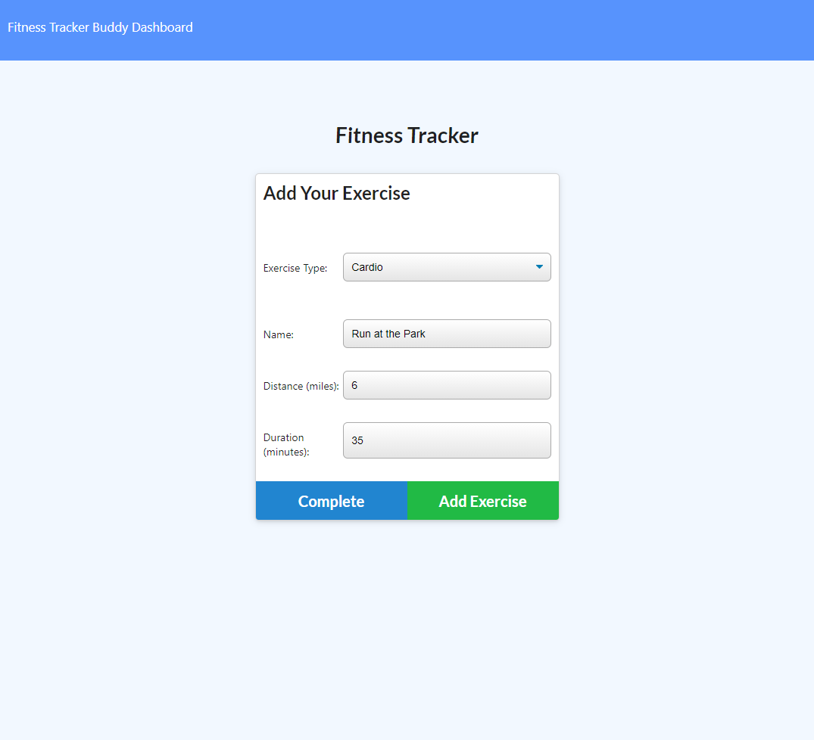

# fitness-tracker-with-mongoDB
[](https://opensource.org/licenses/MIT)

(https://shielded-ocean-64027.herokuapp.com/)

An app to keep track of your fitness activities
## Table of contents
* [General info](#general-info)
* [Technologies](#technologies)
* [Install](#install)

## General info
This application uses a noSQL MongoDB database to store workout history organized by the amount of exercise per day over the past seven days. A dashboard provides daily comparison of the duration and type of exercise ove the past 7 days of activity. The new exercise form allows you to add a cardio or resistance workout.
	
## Technologies
Project is created with:
* Javascript
* Node.js 
* Express.js
* Mongoose
* MongoDB Atlas
* Morgan 

## Install
To install locally, download the repository. Make sure you have node.js installed. Open your terminal and run

``` npm install ``` 

To fill in a sample database.

``` npm run seed```
 
To start the application

``` npm start``` 





